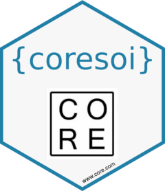

<!-- README.md is generated from README.Rmd. Please edit that file -->

```{r, include = FALSE}
knitr::opts_chunk$set(
  collapse = TRUE,
  comment = "#>",
  fig.path = "man/figures/README-",
  out.width = "100%"
)
```

# coresoi 

<!-- badges: start -->
[](https://CRAN.R-project.org/package=core-soi)
[](https://lifecycle.r-lib.org/articles/stages.html#experimental)
[](https://app.codecov.io/gh/CORE-forge/core-soi?branch=main)
<!-- badges: end -->

The goal of `coresoi` is to offer a _sandbox_ in which researchers and anti-corruption analysts may play and interact with the set of indicators we designed, offering also mock data extracted from [dati.anticorruzione](https://dati.anticorruzione.it/index.html#/home).

## Installation

You can install the development version of coresoi from [GitHub](https://github.com/) with:

``` r
# install.packages("devtools")
devtools::install_github("CORE-forge/coresoi")
```

## Example: Compute indicator High Winning Rate 

There might be the case in which you have to compute the indicator n° 1, which mainly accounts for companies that after the Emergency outbreak (in this case Coronavirus) were awarded public contracts much more frequently than before the Emergency. Indicator 11 computes a [Fish exact's test](https://en.wikipedia.org/wiki/Fisher%27s_exact_test) in proportion from _pre_ and _post_ emergency, poiting out if there is any statistical significance between the two group proportions.
The resulting indicator follows a schema generated through `coresoi::generate_indicator_schema`.

```{r example}
library(coresoi)
library(dplyr)

## basic example code with ind_1() i.e. High Winning Rate
ind_1_res <- ind_1(
  data = mock_data_core, 
  publication_date = data_pubblicazione, 
  cpv = cod_cpv, 
  stat_unit = provincia,
  emergency_name = "coronavirus")
ind_1_res
```

Let's now visualize results for top 10 provinces given High Winning Rate  indicator estimate.

```{r plot}
library(ggplot2)
library(forcats)
library(tidyr)
drop_na(ind_1_res) %>% 
  ggplot(aes(y = fct_reorder(aggregation_name, indicator_value), x = indicator_value)) +
  geom_col() +
  scale_y_discrete(guide = guide_axis(check.overlap = TRUE)) +
  labs(
    y = "",
    x = "Fisher' Exact test pvalue (indicator 1)"
  )

```


## CORE ecosystem

`coresoi` is part of of the project CO.R.E.- Corruption risk indicators in emergency, financed by the EU Commission, as part of the Internal Police Security Fund (ISF-P) program,
The project presented by the Department of Political Sciences as leader with the coordination of Prof. Gnaldi (PI) was funded for a total of 514 thousand euros. The working group is made up of colleagues Prof. Enrico Carloni, Prof. Marco Mazzoni, Prof. Benedetto Ponti, Prof. Maria Giovanna Ranalli. The international network involves Universitat Obierta Catalunya (Spain), Dublin City University (Ireland), Oficina Antifrau de Catalunya (Spain), Infonodes (Italy), Transparency International (Portugal), Villa Montesca Foundation (Italy).
The C.R.E. focuses on assessing the risk of corruption in public procurement from a preventive perspective. In view of achieving this goal, central to the European agenda, CO.R.E. it therefore intends to develop and validate a procedure for constructing a synthetic indicator of the risk of corruption in an emergency period that can be usefully used by national anti-corruption agencies, the media and citizens for accountability purposes.


## 📝 TODOs

- setup google analytics
- build a template for package
- less error prone function indicators (+ escapes, type checkers etc.)
- fix aggregation bug on `ind_11()`
- mettere jl n uovo `test_data` con 100'000 più recenti


## Code of Conduct

Please note that the core-soi project is released with a [Contributor Code of Conduct](https://contributor-covenant.org/version/2/1/CODE_OF_CONDUCT.html). By contributing to this project, you agree to abide by its terms.
