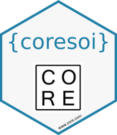
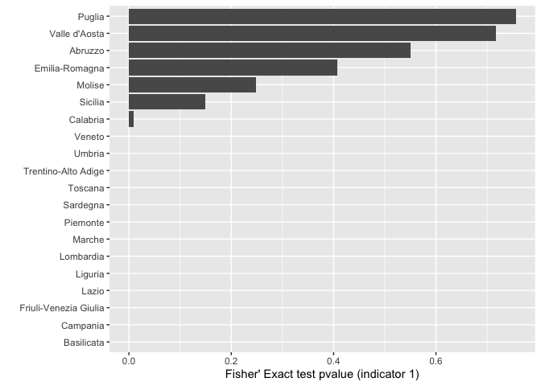

<!-- README.md is generated from README.Rmd. Please edit that file -->

# coresoi 

<!-- badges: start -->

[](https://CRAN.R-project.org/package=core-soi)
[](https://lifecycle.r-lib.org/articles/stages.html#experimental)
<!-- badges: end -->

The goal of `coresoi` is to offer a *sandbox* in which researchers and
anti-corruption analysts may play and interact with the set of
indicators we designed, offering also mock data extracted from
[dati.anticorruzione](https://dati.anticorruzione.it/index.html#/home).

## Installation

You can install the development version of coresoi from
[GitHub](https://github.com/) with:

``` r
# install.packages("devtools")
devtools::install_github("CORE-forge/coresoi")
```

## Example: Compute indicator High Winning Rate

There might be the case in which you have to compute the indicator n° 1,
which mainly accounts for companies that after the Emergency outbreak
(say Covid-19) were awarded public contracts much more frequently than
before the Emergency. Indicator 11 computes a [Fish exact’s
test](https://en.wikipedia.org/wiki/Fisher%27s_exact_test) in proportion
from *pre* and *post* emergency, poiting out if there is any statistical
significance between the two group proportions. The resulting indicator
follows a schema generated through `coresoi::generate_indicator_schema`.

``` r
library(coresoi)
library(dplyr)
#> 
#> Attaching package: 'dplyr'
#> The following objects are masked from 'package:stats':
#> 
#>     filter, lag
#> The following objects are masked from 'package:base':
#> 
#>     intersect, setdiff, setequal, union

## basic example code with ind_1() i.e. High Winning Rate
ind_1_res <- ind_1(
  data = test_data_bndcp_core, 
  publication_date = data_pubblicazione, 
  cpv = cod_cpv, 
  stat_unit = nome_regione2) %>% 
  mutate(
    across(where(is.numeric), ~round(., 3))
  ) %>% 
  na.omit(aggregation_name)

ind_1_res
#> # A tibble: 20 × 12
#> # Rowwise: 
#>    indicator_id idicat…¹ indic…² aggre…³ emerg…⁴ emerg…⁵ aggre…⁶ aggre…⁷ count…⁸
#>           <dbl> <chr>      <dbl> <fct>     <dbl> <chr>   <chr>   <chr>   <chr>  
#>  1            1 High wi…   0.55  Abruzzo       3 other   ISTAT1  nuts_2  1      
#>  2            1 High wi…   0     Basili…       3 other   ISTAT1  nuts_2  1      
#>  3            1 High wi…   0.01  Calabr…       3 other   ISTAT1  nuts_2  1      
#>  4            1 High wi…   0     Campan…       3 other   ISTAT1  nuts_2  1      
#>  5            1 High wi…   0.408 Emilia…       3 other   ISTAT1  nuts_2  1      
#>  6            1 High wi…   0     Friuli…       3 other   ISTAT1  nuts_2  1      
#>  7            1 High wi…   0     Lazio         3 other   ISTAT1  nuts_2  1      
#>  8            1 High wi…   0     Liguria       3 other   ISTAT1  nuts_2  1      
#>  9            1 High wi…   0     Lombar…       3 other   ISTAT1  nuts_2  1      
#> 10            1 High wi…   0     Marche        3 other   ISTAT1  nuts_2  1      
#> 11            1 High wi…   0.249 Molise        3 other   ISTAT1  nuts_2  1      
#> 12            1 High wi…   0     Piemon…       3 other   ISTAT1  nuts_2  1      
#> 13            1 High wi…   0.756 Puglia        3 other   ISTAT1  nuts_2  1      
#> 14            1 High wi…   0     Sardeg…       3 other   ISTAT1  nuts_2  1      
#> 15            1 High wi…   0.149 Sicilia       3 other   ISTAT1  nuts_2  1      
#> 16            1 High wi…   0     Toscana       3 other   ISTAT1  nuts_2  1      
#> 17            1 High wi…   0     Trenti…       3 other   ISTAT1  nuts_2  1      
#> 18            1 High wi…   0     Umbria        3 other   ISTAT1  nuts_2  1      
#> 19            1 High wi…   0.717 Valle …       3 other   ISTAT1  nuts_2  1      
#> 20            1 High wi…   0     Veneto        3 other   ISTAT1  nuts_2  1      
#> # … with 3 more variables: country_name <chr>, indicator_last_update <dttm>,
#> #   data_last_update <dttm>, and abbreviated variable names ¹​idicator_name,
#> #   ²​indicator_value, ³​aggregation_name, ⁴​emergency_id, ⁵​emergency_name,
#> #   ⁶​aggregation_id, ⁷​aggregation_type, ⁸​country_id
```

Let’s now visualize results for top 10 provinces given High Winning Rate
indicator estimate.

``` r
library(ggplot2)
library(forcats)
library(tidyr)
ggplot(drop_na(ind_1_res), aes(y = fct_reorder(aggregation_name, indicator_value), x = indicator_value)) +
  geom_col() +
  labs(
    y = "",
    x = "Fisher' Exact test pvalue (indicator 1)"
  )
```



## CORE ecosystem

`coresoi` is part of of the project CO.R.E.- Corruption risk indicators
in emergency, financed by the EU Commission, as part of the Internal
Police Security Fund (ISF-P) program, The project presented by the
Department of Political Sciences as leader with the coordination of
Prof. Gnaldi (PI) was funded for a total of 514 thousand euros. The
working group is made up of colleagues Prof. Enrico Carloni, Prof. Marco
Mazzoni, Prof. Benedetto Ponti, Prof. Maria Giovanna Ranalli. The
international network involves Universitat Obierta Catalunya (Spain),
Dublin City University (Ireland), Oficina Antifrau de Catalunya (Spain),
Infonodes (Italy), Transparency International (Portugal), Villa Montesca
Foundation (Italy). The C.R.E. focuses on assessing the risk of
corruption in public procurement from a preventive perspective. In view
of achieving this goal, central to the European agenda, CO.R.E. it
therefore intends to develop and validate a procedure for constructing a
synthetic indicator of the risk of corruption in an emergency period
that can be usefully used by national anti-corruption agencies, the
media and citizens for accountability purposes.

## 📝 TODOs

-   setup google analytics
-   build a template for package
-   less error prone function indicators (+ escapes, type checkers etc.)
-   fix aggregation bug on `ind_11()`
-   mettere jl n uovo `test_data` con 100’000 più recenti

## Code of Conduct

Please note that the core-soi project is released with a [Contributor
Code of
Conduct](https://contributor-covenant.org/version/2/1/CODE_OF_CONDUCT.html).
By contributing to this project, you agree to abide by its terms.
