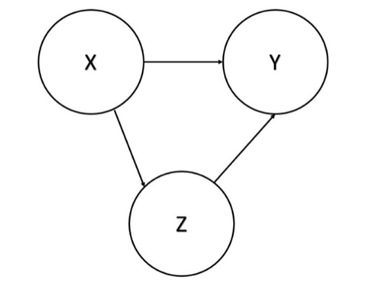
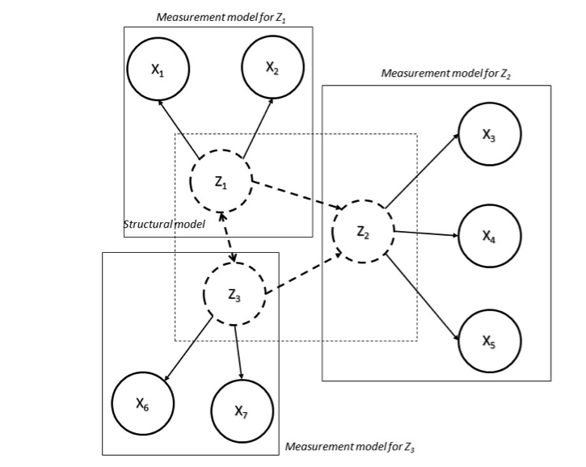

```{r, include = FALSE}
knitr::opts_chunk$set(
  collapse = TRUE,
  comment = "#>"
)
```

### **Normalisation methods**

Normalisation is required in order to make the indicators comparable when they have different measurement units or when they have a particularly skew distribution.
In addition, according to the aggregation method used, it is also required when indicators have different polarity.
With this regard, it is common to normalise indicators that are negatively correlated with the latent phenomenon to be measured (negative 'polarity') so that they become positively correlated with the latent phenomenon (positive 'polarity').
In this way, larger values of the normalised indicator result in larger values of the CI.
There are various normalisation methods, such as ranking, standardisation (or z-scores), re-scaling (or min-max transformation), indexing (index number transformation or 'distance' to a reference), and categorisation.
A complete review and a thorough discussion of possible normalisation methods is provided in OECD (2008) and in Otoiu et al. (2021) .
Here we will provide only the two that are relevant to our application, as many red flags are binary.
Let be the q-th simple indicator, for q = 1, ..., Q, of the c-th unit, for c = 1, ..., C; Q is the overall number of simple indicators and C is the overall number of units.

-   Standardisation (z-scores): For each indicator, the difference between the original values and the mean over the units is divided by the standard deviation. In this way, indicators have a common scale with mean 0 and standard deviation 1. If an indicator has negative polarity, standardized values can be multiplied by -1.

$$
\begin{equation} I_{qc} = \frac{x_{qc}-\mu_q(x_{qc})}{\sigma_q(x_{qc})} \end{equation}
$$

-   Rescaling (Min-Max transformation). The difference between the original values and the minimum is divided by the range of an indicator. Transformed indicators have a common scale ranging between 0 and 1. Therefore, this transformation should be applied only to non-binary red flags. If an indicator has negative polarity, the complement of rescaled values with respect to 1 can be calculated.

$$
\begin{equation} I_{qc} = \frac{x_{qc} - min_c(x_{qc})}{max_c(x_{qc})- min_c(x_{qc})} \end{equation}
$$

Standardisation and rescaling are both applicable to indicators with positive, negative and zero values, and they are both sensitive to outliers.
Standardisation provides indicators with equal variances, it is not very suitable for bounded indicators and it produces negative values, while rescaling provides indicators with equal range, it is not very suitable for unbounded indicators.

### **Weighting and aggregation schemes**

In order to obtain a single CI from a set of individual indicators, two other important choices are at stake: the weighting system and the aggregation scheme.
The former implies the scale of importance of each individual indicator, while the latter identifies the technique (compensatory, partially compensatory or non-compensatory) for summarising the individual indicator values into a single number.
Weights should reflect the relative importance of the individual indicators and heavily influence the outcomes of the CI.
The most widely used techniques for weighting individual indicators are the following (Otoiu et al. 2021): a) no weighting, that implies that equal weights are applied to all individual indicators; b) subjective or expert weighting, where group of specialists define weights for each indicator; and c) objective or 'data-driven' weighting, as when the coefficients of the first factor of Principal Component Analysis are used as weights (this is the set of weights that explains the largest variation in the original indicators).
The choice of the weighting system is usually by far the most influential among the others on the final CI value and related rankings [@gnaldi2015].
The choice of the aggregation scheme, on the other hand, heavily depends on the degree of compensability or substitutability of the individual indicators.
A compensatory approach involves the use of linear functions, such as a linear combination of the normalised individual indicators, whereas a partially compensatory or non-compensatory approach requires the use of non-linear functions, such as with a multiplicative approach.
In the first case, the CI for unit c can be obtained as follows,

$$
\begin{equation} C_I = \sum_{q=1}^{Q} w_q I_{qc} \end{equation}
$$

where $0 \leq w_q \leq 1$ is the weight given to indicator $q$, and it is such that $\begin{equation} C_I = \sum_{q=1}^{Q} w_q = 1 \end{equation}$.
When using a geometric aggregation rule,

$$
\begin{equation} C_{I_c}=\prod_{q=1}^{Q} I_{q_c}^{w_q} \end{equation}
$$

partial compensability is allowed.
This choice is advisable in our case, if, on a conservative perspective, even a small achievement in any of the red flags is crucial for the overall risk of corruption.
The additive and the multiplicative aggregation functions can be seen as special cases of a generalised mean or power mean of order r, where for the arithmetic mean and for the geometric mean.
Alternative aggregation methods are, among others, the Wroclaw Taxonomic Method, the Mean-Min Function, and the Mazziotta-Pareto Index (for details see Otoiu et al., 2021).

### **Multivariate analysis for the study of the data structure**

It is broadly known that corruption and corruption risk is a complex and latent phenomenon and the red flag indicators, obtained in a particular context, consist in the observable manifestation of it.
When building a CI of corruption risk, the set of available red flags is transformed in a unique measure of the phenomenon they contribute to measure.
In doing this, however, the phenomenon is considered as if it were unidimensional, as it is assumed that each single red flag is expression of the same unique underlying construct (corruption).
On the other hand, it might be reasonable to suppose the existence of several dimensions or groups of red flag indicators, which measure, from different perspectives, several aspects of the same (multidimensional) phenomenon.\
For this reason, a dimensionality assessment is crucial in the process of construction of every CI, with the aim of discovering whether the phenomenon at issue could be considered unidimensional or multidimensional.
To this end, multivariate statistical techniques are available for acknowledging the multidimensionality of a latent phenomenon, especially in choosing number and composition (in terms of observable indicators) of the sub-dimensions to be accounted for.
In this regard, these methods can have confirmatory or exploratory nature.
The former type requires an a priori specification of the dimensionality structure -- i.e., which dimensions characterise the phenomenon and which indicators contribute to measure each one -- and allows us to assess the goodness of fit of this solution to the data at hand.
However, it is difficult to have prior information on its dimensionality structure and, consequently, it is not trivial to specify it in practice.
Conversely, the latter kind of methods do not assume any particular dimensionality structure and perform an exploratory analysis of all the possible dimensionality solutions, proposing those that better fit to the data at hand.
The selection of the final solution can be carried out by means of objective (statistical) and/or subjective criteria.
As mentioned above, this dimensionality evaluation is a fundamental step when building a CI.
It helps to consider the suitability of the data at issue for representing the latent phenomenon under study and will contribute to understand the implications of other methodological choices (e.g., related to weighting, aggregation, etc.) during the entire process of composite indicator construction.
In fact, individual indicators are often chosen arbitrarily, paying little attention to the relationship among them and leading to the "indicator rich but information poor" environment, that is, composites that do not contribute to add knowledge, but conversely are overwhelmed, confused and misleading (OECD, 2008).

#### *Principal Component Analysis*

Principal Component Analysis i.e.
PCA [@abdi2010] is one of the most widely known method of multivariate statistical analysis.
Given a set of Q variables (or indicators), x1, ..., xQ, the purpose is to find few linear combinations of them (i.e, the principal components, PC) in order to explain their variance as much as possible.
In fact, even if we have Q variables, most of their variability may be accounted for by only a small number of them, say R.
The idea behind this approach is that the single principal component is measuring a different dimension of the data and should include those indicators that mostly contribute to this measurement, hence those with a high degree of correlation among them.\
The principal components, denoted by Pr, are therefore estimated by combining (linearly) the observed Q variables so that they are uncorrelated each other.
Theoretically, given Q variables, it is possible to find as many principal components, that is,

$$
\begin{equation} P_1=\alpha_{Q1}x_1+\alpha_{Q2}x_2+...+\alpha_{QQ}x_Q \end{equation}
$$


where $\alpha_{rq}$ are weights (also called component of factor loadings) related to variable $x_q$ and component $P_r$, $r,q = 1,…,Q$, such that the principal components are uncorrelated and contribute to explain a decreasing share of the overall variability of $x$, that is, the first $PC (r = 1)$ accounts for the maximum possible proportion of variance in the observed variables, the second $PC (r = 2)$ accounts for the maximum of the remaining variance, and so on.
The objective is therefore to select the first $R << Q$ principal components in order to explain a high amount of variance of the observed data.
Principal components are extracted by computing the eigenvalues of the $Q x Q$ covariance matrix computed on the observed variables.
The *eigenvalues* correspond to the variances of the principal components and in theory $Q$ eigenvalues can be computed (as many as the variables), but some of them can be negligible.
Moreover, the sum of the eigenvalues is equal to the sum of the variances of the indicators, then the ratio between each eigenvalue and their sum is the proportion of variance that each one contributes to explain.
Consequently, in order to select the number of components to retain (i.e., R), an analysis of the eigenvalue decomposition of the covariance matrix is needed.
In practice, it is common to consider a predefined share of total variance explained (e.g., 70% or 80%), then R will be equal to the number of eigenvalues that contribute to explain this part of variance.
However, two or three PCs are often selected in order to have a graphical representation of the resulting solution.

#### *factor analysis*

Like PCA, Factor Analysis (FA; McDonald, 2014) aims at finding a reduced number of unobserved variables (i.e., the latent factors) from an observed pool of $Q$ indicators, say $x1, …, xQ$, in order to underline the relationships among them.
Differently from PCA, FA is based on a statistical model, through which the data variance can be decomposed into two parts, that explained by the factors and that still unexplained.
Hence, given a set of Q variables (indicators) and R factors, FA considers the following model:

$$
\begin{equation} x_1=\gamma_{Q1}F_1+\gamma_{Q2}F_2+...+\gamma_{QR}F_R+\epsilon_q \end{equation}
$$

where $\gamma_{qr}$ represents the factor loading of indicator q on factor r, Fr is a common factor, with r = 1,...,R, and $\epsilon_q$ is a unique factor, with $q = 1,…,Q$, and corresponds to the error term in the regression model, with zero mean, independent and identically distributed with respect to each variable.
Factor loadings summarise the relationships between indicator and factor and can be seen as standardised regression coefficients, ranging between **-1** and **1**.
Several approaches are available for extracting the factors, such as PCA, maximum likelihood, centroid method, principal axis method, etc.
However, the crucial issue is how many factors retain and different methods are proposed in this regard, most of them based on the eigenvalue decomposition of the covariance matrix among the indicators.
The Kaiser criterion suggests dropping all factors with eigenvalues below 1 as it is supposed that their contribution to the variance explained is negligible.
Moreover, like for PCA, one can decide to set a predetermined and desired share of explained variance (e.g., 80%) and retain a number of factors that allows for this.
Alternatively, another proposal is to inspect the scree plot, that is, a plot of the successive eigenvalues and look when it drops sharply and becomes flat, also known as elbow method [@syakur2018].
Other proposals to select the number of factors are, for example, the Joliffe criterion or the parallel analysis, but it is important to remark that, despite a solution is the optimal one according to, say, objective criteria, it could lead to results of difficult interpretability and comprehension.
For this reason, together to indices closely related to statistical/objective criteria, a degree of subjectivity should be adopted.
Once the number of factors is selected, a good practice is to perform a rotation of the factor loadings for reasons of interpretability of the resulting solution.
It would be ideal that a simple solution was reached, that is, a clear pattern of loadings where each indicator has only one high value on one factor, and near-zero values on the others, so that each indicator could be associated with one and only one factor.
Several rotation methods exist and can be divided into two groups, those based on orthogonality (uncorrelation) among factors (such as varimax, quartimax and equimax), and those relaxing the orthogonality constraint, the so-called oblique rotation methods (such as oblimin and promax).

#### *item response theory*

Item Response Theory (IRT) models (see @bartolucci2015 for an outline) can be considered as one the most well-known latent variable models.
They work with categorical indicators and are based on latent variables, also called latent traits, which represent the latent phenomenon under study (i.e., corruption risk in our case).
IRT models allow us to mathematically specify the probability of observing a value in the indicator as monotonic non-decreasing function of indicator characteristics (difficulty, discrimination, etc.) and latent trait level, namely the Item Characteristic Curve (ICC).
The most famous IRT model is the Rasch model (Rasch, 1961), especially used in the educational field, where the indicators at issue (e.g., items of an assessment test) are dichotomous (1 = correct, 0 = wrong response).
The Rasch model has the following **ICC**:

$$
\begin{equation} P\left(x_{cq}=1\mid \theta_c\right)=\frac{\exp\left(\theta_c -\beta_q \right)}{1+\exp\left(\theta_c-\beta_q\right)} \end{equation}
$$

where $x_{}cq$ denotes the indicator $q$ of unit $\theta_c$, is the latent trait level of unit c and $\beta_q$ is the difficulty parameter of item $q$, $c = 1,…,C$ and $q = 1,…,Q$.
The latter parameter defines the location of the ICC over the latent trait space and can be interpreted as the latent trait level needed to have with 50% of probability.
The Rasch model is also known as 1PL (one-parameter logistic) model, as it considers $i$.
the logistic function for defining the probability defined on the left-hand side and ii.
only one parameter on the right-hand side.
In fact, it assumes that each item (indicator) has the same discrimination power, that is, the capacity of that item to differentiate between units with different latent trait levels.
If we relax this constraint, we have the 2PL (two-parameter logistic) model (Birnbaum, 1968):

$$
\begin{equation} P\left(x_{cq}=1\mid \theta_c\right)=\frac{\exp\left[\gamma_q\left(\theta_c -\beta_q\right)\right]}{1+\exp\left[\gamma_q\left(\theta_c-\beta_q\right)\right]} \end{equation}
$$

where $\gamma_q$ is the discriminating parameters, which defines the slope of the ICC.
Other IRT models can be specified according to the type of indicators (dichotomous or polytomous), the number of parameters used for defining the ICC (one, two, three, etc.), the distribution of the latent variable (discrete or continuous), and the link function (i.e., the function that connects the parameters -- right hand side of the above equations -- with the conditional probability of observing a value in the indicator -- left hand side).
IRT models were initially defined for modelling unidimensional phenomena, represented by a univariate random (and latent) variable, namely .
However, multidimensional IRT models are proposed (Reckase, 2009), where the latent variable is multivariate, hence a random vector, in which each component represents a dimension of the phenomenon at issue.
Like for PCA or FA, confirmatory or exploratory approaches are available also in the IRT framework.

#### *Structural Equation Modelling*

Structural Equation Modelling i.e.
SEM (@raykov2000 ; Nachtigall et al., 2003) is a flexible framework that integrates several techniques of multivariate statistical analysis.
Its main purpose is to estimate the presence and magnitude of relationships among variables using some key features of path analysis (Wright, 1934).
For example, let us consider three variables, $X$, $Y$ and $Z$, whose relationships can be summarised as reported in Figure 1.
We can notice that the effect of X on Y is two-fold: i.
a direct effect between $X$ and $Y$ (represented by the direct path from $X$ to $Y$), and ii.
an indirect effect mediated through Z (represented by the path from $X$ to $Y$ via $Z$).
Hence, the total effect of $X$ on $Y$ is obtained by summing up these two components and the path analysis techniques are suitable for estimating direct, indirect, and total effects among variables.
Moreover, $SEM$ can deal with latent variables, of which the observed indicators are overt manifestations.
Therefore, two different stages of modelling approaches are available in $SEM$: i.
that related to the measurement models (e.g., one for each supposed latent variables), which specify the relationship between observed variables and the underlying latent one, and ii.
that regarding the connections among latent variables, defined through the structural models.



An example of a rather simple $SEM$ is reported in Figure 2, where we have 7 indicators $(X1,…,X7)$ that concur to measure three latent variables $(Z1, Z2, Z3)$.
In this situation we need three measurement models for handling the relationships between the observed indicators and the three latent variables.
Moreover, the structural model specifies that $Z1$ and $Z3$ have both a direct effect of $Z2$, but they also affect each other.



Several logical steps contribute to define an analysis strategy based on SEM.
The first step is the model specification, which specifies the supposed relationships among the variables (observed and unobserved) according to the theory or previous knowledge on the phenomenon under study.
Before fitting the model, one has to check about its identification, in order to avoid that it was under-identified, since in this case it would be impossible estimate model parameters.
This stage refers to an assessment of the quality/quantity of observed indicators for representing the latent variables -- see @rigdon1995]for more specific details.
Afterwards, the model has to be fitted on the data at hand and evaluated using quantitative indices about the goodness of fit, such as the Root Mean Square Error of Approximation, Comparative Fit Index, Bayesian Information Criterion, Akaike Information Criterion, etc.
If necessary, the model can be modified in order to improve the model fitting, with contextual repetition of all the above steps.

#### *Sensitivity analysis*

The selection of individual indicators, the choice of the normalisation method, of the weighting system, and of the aggregation scheme are all potential sources of uncertainty that affect both the variance of the CIs and the variability of any ranking based on CIs.
In other words, it is expected that the choice to include a particular indicator in the CI, or the choice to employ a normalisation scheme (rather than a different one) can have an impact on the rankings of the individual units according to the CI.
In this context, sensitivity analysis is considered as an appropriate tool to assess such uncertainties as it studies how the variation in the output (CI values and rankings) can be apportioned to different sources of variation in the assumptions, and how the given CI depends upon the information fed into it.
Sensitivity analysis can help to gauge the robustness of the CI value.
In particular, the CI can be computed using all the possible combinations of the alternative possible choices.
For each unit, the distribution of all the possible Cis highlights whether that unit is systematically labeled as corrupt or only under particular circumstances.
**ANOVA** and/or regression analysis can also be conducted on the outcome of the sensitivity exercise to evaluate which of the factors involved in the construction of the CI is more relevant and influential [@gnaldi2015a]

## References
