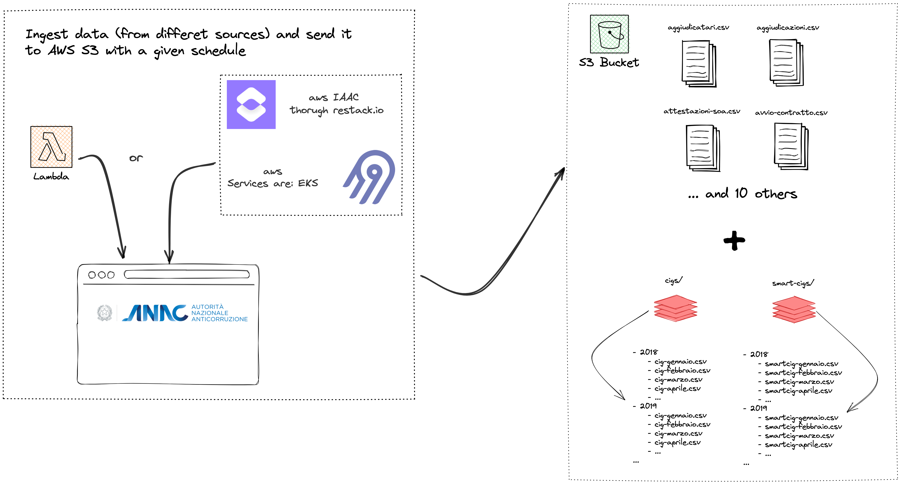
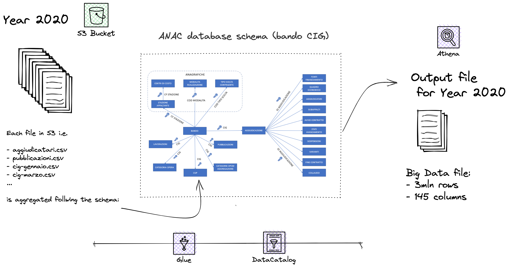
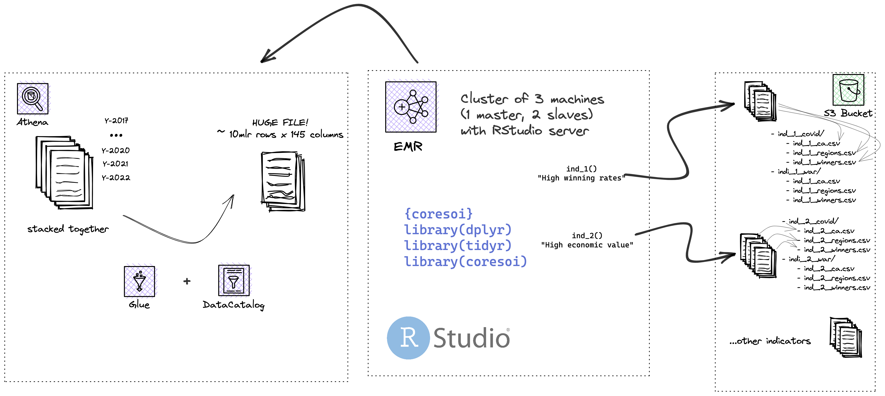
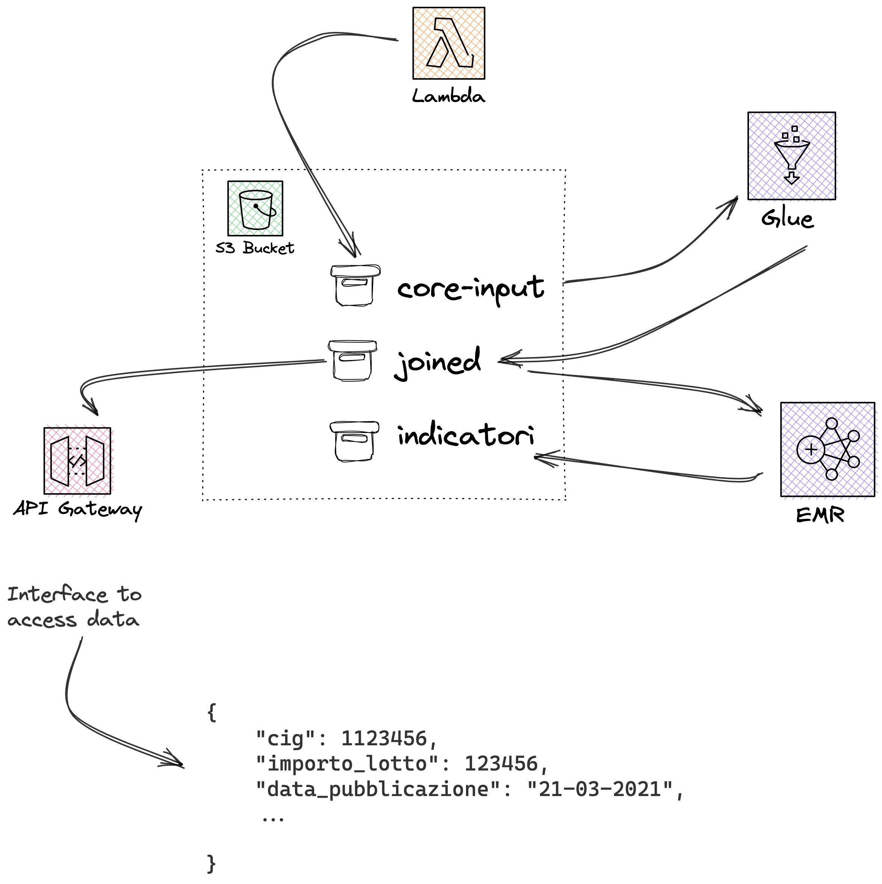

```{r, include = FALSE}
knitr::opts_chunk$set(
  collapse = TRUE,
  comment = "#>"
)
```


Modern statistical approaches are currently under threat from the Big Data era, not only because of the immense processing power required to keep up with the amount and rate at which data is accumulating, but also due to the wide range of sources from which data may be obtained (Arbia et al., 2021). Most of this data, including administrative documents and unstructured data gathered from previously unexplored sources, are readily accessible to the public (such as crowdsourcing, open data portals, web scraping).
As a matter of fact, the web undiscloses a wealth of intriguing material in plain (web) sight that can be collected, aggregated and analyzed. Sometimes web platforms may operate protection mechanisms to avoid users extracting their data. In some other occasions data are stored in open databases and can be accessed through APIs (Application Programming Interface) or through manual download. This is also the case of the Banca Dati Nazionale dei Contratti Pubblici (BNDCP) which is an open data portal offering access information on anti- corruption, transparency, and public contracts, handled by the Italian Anticorruption Authority (ANAC) as part of its institutional functions. The open [data portal](www.anac.gov.it/bndp) is searchable by keyword and offers a series of filters to allow users to refine their results and visualize it through a dashboard. The data are also available in machine-readable format, making it possible to carry out further analysis and distribute them via API through OCDS, which is a common shared standard data model whose goal is to support organizations and help them with transparency. The portal currently contains more than 110 datasets which are divided into three subsections: data on asset declarations, data on conflicts of interest, and data on donations and sponsorships. The data on public contracts are divided into seven subsections: data on contracting authorities, data on economic operators, data on contracts, data on Contracting Procedures, data on tenders, data on awarding criteria, and data on contract prices.
Utilizing this enormous quantity of data requires a programmatic approach in addition to a strong grounding in various web technologies.
A Big Data pipeline (from now on data pipeline) is a set of processes that ingest, clean, transform, and store data. Data pipelines are essential for data-driven applications, as they provide a way to reliably and efficiently move data from one place to another. Data pipelines can be batch or real-time, depending on the needs of the application. Batch data pipelines are typically used for ETL (extract, transform, load) processes, where data is extracted from one or more sources, transformed into a format that is suitable for analysis, and then loaded into a target data store. Data pipelines can be complex, with many different components that must work together in order for the data to flow smoothly from one stage to the next. In order to build a data pipeline, it is of the utmost importance to have a clear understanding of the data flow, the scope (the data consumers objectives) and the dependencies between the various components. In this regard, we discuss the data pipeline for a web-based application that ingests data from a public open data portal. The data pipeline consists of the following components: a **web scraper**, a **data parsing and aggregation**, a **data transformer**, and a **data store** (i.e. database). The web scraper is responsible for extracting data from the BNDCP [open data portal](https://dati.anticorruzione.it/#/home), this happens according to a schedule which is coordinated with the updating rate of the source. Moreover, data are actually extracted i.e. scraped from 3 different BDNCP locations: the official BDNCP datasets as mentioned above, the L190 communication default which account for transmissions between CA (Contracting Authorities) and ANAC, finally from a proprietary source. The latter can enrich data regarding winners and participants of the bid, such as their number of employees, type of company, revenues and CAE (Economic Activity Code). The information is crucial to assess the potential risks of participating and winning on different entities.



The parsing and aggregation step is done via AWS Glue which is a fully-managed ETL (extract, transform, and load) service that makes it easy to move data between data stores. It uses Apache Spark as its underlying engine for distributed processing of data. The data parser in AWS Glue is responsible for parsing the data extracted by the web scraper and accounts for the file extensions the organization adopts to replicate data across the infrastructure. By using Apache Spark, AWS Glue can efficiently aggregate and join files for processing. Once data are joined according to the schema ANAC provided in [this document](https://dati.anticorruzione.it/opendata/download/ManualeGestioneOperativa-OD.pdf)



Specifically, the data transformation process is being run on Amazon Elastic MapReduce (EMR), which is a cloud-based big data platform that allows  to process vast amounts of data using open-source tools such as Apache Spark, Apache Hive, Apache HBase, Apache Flink, and Presto.
One of the key benefits of using a cloud-based platform like Amazon EMR is that it allows to distribute computation across a cluster of machines, which can help to avoid running out of memory or experiencing other performance bottlenecks when working with big data. This means that the data transformation process can be completed faster and more efficiently than if it were run on a single machine or server. Additionally, because it is only paid for the resources that are actually used. This can save costs compared to maintaining an on-premises infrastructure.

The data store is the final component of the data pipeline. In order to choose the most appropriate data store, we need to consider a number of factors such as: capacity, performance, availability, durability, security. In our case we decided to use Amazon Simple Storage Service (S3). Amazon S3 is an object storage service that offers industry-leading scalability, data availability, security, and performance. The data store is responsible for storing the transformed data. Finally, the aggregated data, which results in a very large file with more than 10 millions rows and 150 columns, stays in S3 and waits for a further transformation exploiting the same cloud means presented. On top of this, massive indicator files (and the one resulting from the composition of them) are calculated, generating a number of further files. Each of these indicator file must adhere to a schema, meaning that the outcome of the calculation must include the date of generation, the target statistical measurement unit, among the others, and obviously the indicator value. This needs to happen mainly for frontend requirements purposes, so that whenever the client-side user requests for that information, say indicator 1, the frontend has to put the effort only into recalling the files that actually contains that information.
For each indicator, a number of files are actually generated: one for each emergency scenario considered (Covid19, Ukraine - Russia war, etc.) and one for each target statistical unit of measurement (CA, winner and participants via their tax code or geographical aggregation units, regions, municipalities). The indicator generation process is quite straightforward: given an emergency scenario (two are currently supported: Covid19, Ukraine - Russia war), the data on the target units of measurement (often being referred to statistical units: CA, winner and participants via their tax code or geographical aggregation units, regions, municipalities), a list of indicators and the associated calculation rules, the pipeline automatically generates all the indicator values for all target units. The generation of indicators is actually carried out in two steps: first, all the large data is recollected and sorted, then stored in the local database; then, starting from this partition, the indicators are actually calculated according to the rules associated with each of them and stored in files, once again in S3 spaces.





There's also a further component, the API gateway which makes possible to directly query data from the datastore.

A bird-eye view of the overall infrastructure



